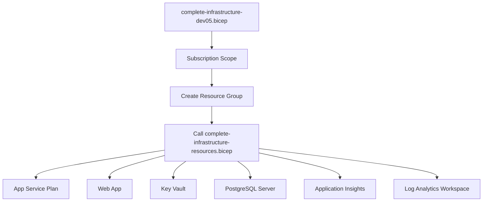

# 🏗️ Architecture Bicep - ChatBottez GPT-4.1

## 📋 **Vue d'Ensemble**

Ce document explique l'architecture des templates Azure Bicep utilisés dans le projet ChatBottez GPT-4.1 et pourquoi il existe plusieurs fichiers Bicep.

---

## 🎯 **Raisons des Multiples Fichiers Bicep**

### 1. **Évolution Historique du Projet**
Le projet a évolué à travers plusieurs itérations, chacune nécessitant des templates Bicep adaptés aux besoins spécifiques de chaque phase.

### 2. **Architecture Modulaire**
Séparation des préoccupations avec des modules spécialisés pour différents composants Azure.

### 3. **Environnements Multiples**
Support de différents environnements (dev, staging, prod) avec des configurations spécifiques.

---

## 📂 **Structure des Fichiers Bicep**

### 🟢 **Fichiers Actifs (v1.7.0)**

#### **Template Principal - DEV-05**
```
📁 infra/
├── 🟢 complete-infrastructure-dev05.bicep      [ACTUEL - Subscription Level]
├── 🟢 complete-infrastructure-resources.bicep  [ACTUEL - Resource Group Level]
└── 🟢 complete-infrastructure-dev05.parameters.json
```

**Rôle** : Templates actuellement utilisés pour l'environnement DEV-05 en production.

#### **Modules Spécialisés**
```
📁 infra/
├── 📁 botRegistration/
│   └── 🟡 azurebot.bicep                       [Module Bot]
├── 📁 database/
│   └── 🟡 postgres.bicep                       [Module PostgreSQL]
└── 📁 apim/
    └── 🟡 apim.bicep                            [Module API Management]
```

**Rôle** : Modules réutilisables pour des composants spécifiques.

#### **Template Teams Framework**
```
📁 infra/
└── 🟡 azure.bicep                               [Teams Toolkit Legacy]
```

**Rôle** : Template original du Teams Framework, conservé pour compatibilité.

### 🔵 **Fichiers de Référence**

#### **Templates de Base**
```
📁 infra/
├── 🔵 complete-infrastructure.bicep             [Template Base]
└── 🔵 azure.parameters.json                    [Paramètres Teams]
```

**Rôle** : Templates de référence et versions antérieures.

---

## 🏗️ **Architecture Actuelle DEV-05**

### **Flux de Déploiement**



### **Hiérarchie des Templates**

1. **🎯 Subscription Level** (`complete-infrastructure-dev05.bicep`)
   - Crée le Resource Group
   - Configure les tags globaux
   - Appelle le module ressources

2. **🔧 Resource Group Level** (`complete-infrastructure-resources.bicep`)
   - Déploie toutes les ressources Azure
   - Configure les dépendances entre ressources
   - Applique les configurations de sécurité

---

## 📊 **Ressources Déployées (DEV-05)**

### **Infrastructure Actuelle**
| Ressource | Nom | Type | Status |
|-----------|-----|------|--------|
| **Resource Group** | `rg-chatbottez-gpt-4-1-dev-05` | Container | ✅ Déployé |
| **App Service Plan** | `plan-chatbottez-gpt41-dev-rnukfj` | Windows P1v2 | ✅ Déployé |
| **Web App** | `chatbottez-gpt41-app-rnukfj` | Node.js 18 LTS | ✅ Déployé |
| **Key Vault** | `kv-gpt41-rnukfj` | Standard | ✅ Déployé |
| **PostgreSQL** | `psql-chatbottez-gpt41-dev-rnukfj` | Flexible Server | ✅ Déployé |
| **App Insights** | `ai-chatbottez-gpt41-dev-rnukfj` | Application Monitoring | ✅ Déployé |
| **Log Analytics** | `law-chatbottez-gpt41-dev-rnukfj` | Workspace | ✅ Déployé |

### **Configuration Spécifique DEV-05**
- **Location** : Canada Central
- **Environment** : dev-05
- **Suffix** : rnukfj (généré automatiquement)
- **Service Plan** : Windows (P1v2)
- **PostgreSQL** : Version 13, 2 vCores

---

## 🔄 **Historique des Versions**

### **Chronologie des Templates**

| Version | Template | Date | Status | Description |
|---------|----------|------|--------|-------------|
| v1.0 | `azure.bicep` | 2025-08-16 | 🟡 Legacy | Template Teams Framework original |
| v1.4 | `complete-infrastructure.bicep` | 2025-08-18 | 🔵 Référence | Premier template complet |
| v1.5 | `complete-infrastructure-resources.bicep` | 2025-08-18 | 🟢 Actif | Module ressources |
| v1.6 | `complete-infrastructure-dev05.bicep` | 2025-08-18 | 🟢 Production | Template actuel DEV-05 |

### **Fichiers Supprimés (Post-Cleanup)**
```
❌ complete-infrastructure-dev03.bicep     [Supprimé - Version test]
❌ complete-infrastructure-dev03.parameters.json
❌ complete-infrastructure-dev04.bicep     [Supprimé - Version test]  
❌ complete-infrastructure-dev04.parameters.json
```

**Note** : Les références dev03/dev04 dans l'historique des terminaux sont des artifacts d'anciens tests.

---

## 🎛️ **Paramètres et Configuration**

### **Paramètres DEV-05**
```json
{
  "resourceBaseName": "chatbottez-gpt41",
  "environment": "dev",
  "location": "Canada Central",
  "publisherEmail": "heon@cotechnoe.net",
  "publisherName": "ChatBottez",
  "postgresAdminLogin": "[FROM-KEYVAULT]",
  "postgresAdminPassword": "[FROM-KEYVAULT]"
}
```

### **Variables Générées**
- **Suffix** : `rnukfj` (unique par Resource Group)
- **Resource Group** : `rg-chatbottez-gpt-4-1-dev-05`
- **Tags** : Environment=dev, Project=ChatBottez-GPT-4.1, Version=v1.6.0-dev05

---

## 🚀 **Utilisation des Templates**

### **Déploiement Actuel**
```bash
# Template principal utilisé
az deployment sub create \
  --location "Canada Central" \
  --template-file "infra/complete-infrastructure-dev05.bicep" \
  --parameters "@infra/complete-infrastructure-dev05.parameters.json" \
  --name "complete-infrastructure-dev05-$(date +%Y%m%d-%H%M%S)"
```

### **Validation**
```bash
# Validation avant déploiement
az deployment sub validate \
  --location "Canada Central" \
  --template-file "infra/complete-infrastructure-dev05.bicep" \
  --parameters "@infra/complete-infrastructure-dev05.parameters.json"
```

---

## 🔍 **Modules Disponibles**

### **Bot Registration** (`botRegistration/azurebot.bicep`)
- Enregistrement Azure Bot Service
- Configuration Teams
- Managed Identity

### **PostgreSQL** (`database/postgres.bicep`)
- Serveur PostgreSQL Flexible
- Base de données chatbottez
- Règles de firewall

### **API Management** (`apim/apim.bicep`)
- Gateway API
- Politiques de sécurité
- Monitoring

---

## 📋 **Bonnes Pratiques**

### **Naming Convention**
```
[service]-[project]-[environment]-[suffix]
Exemple: app-chatbottez-gpt41-dev-rnukfj
```

### **Sécurité**
- Secrets stockés dans Key Vault
- Managed Identity pour l'authentification
- Principe de moindre privilège

### **Monitoring**
- Application Insights intégré
- Log Analytics centralisé
- Alertes configurées

---

## 🎯 **Prochaines Étapes**

### **Évolutions Prévues**
1. **Template v1.8** : Support multi-environnements
2. **Modules API** : Séparation API Management
3. **CI/CD** : Pipeline Azure DevOps
4. **Scaling** : Configuration auto-scaling

### **Maintenance**
1. Nettoyage périodique des anciens templates
2. Documentation des changements d'architecture
3. Tests de validation automatisés

---

**Créé par** : GitHub Copilot  
**Date** : 18 août 2025  
**Version** : v1.7.0-step6-application-deployment  
**Status** : 📋 Documentation Architecture Bicep
