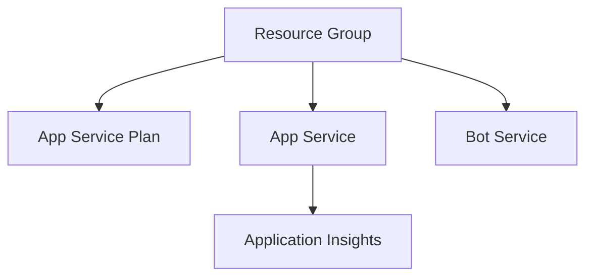
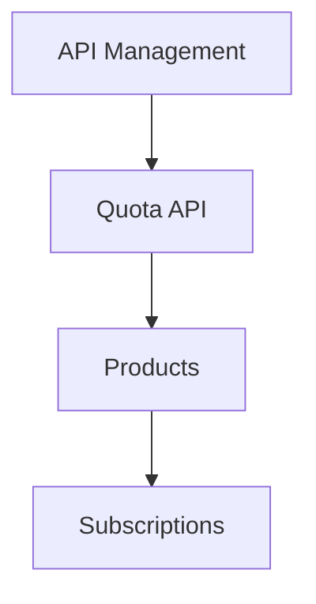
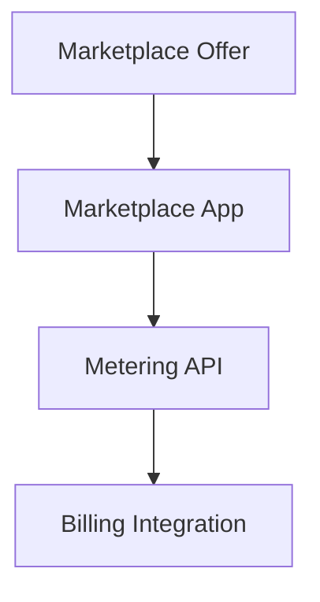
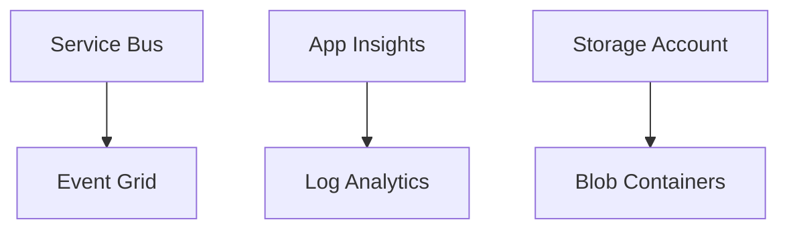

# 📋 Composants Azure - Microsoft Marketplace Quota Management System

> **Date de mise à jour:** 17 août 2025  
> **Projet:** ChatBottez GPT-4.1  
> **Environnement:** Development (rg-chatbottez-gpt-4-1-dev-02)

## 🎯 Vue d'ensemble

Ce document liste tous les composants Azure nécessaires pour le projet Microsoft Teams Bot avec gestion des quotas Marketplace. Les composants sont organisés par catégorie et statut de déploiement.

---

## ✅ Composants Déployés

### 🏢 Gestion des Ressources
| Composant | Type | Nom | Statut | Description |
|-----------|------|-----|---------|-------------|
| **Resource Group** | `Microsoft.Resources/resourceGroups` | `rg-chatbottez-gpt-4-1-dev-02` | ✅ Déployé | Groupe de ressources principal pour l'environnement de développement |

### 💾 Base de Données
| Composant | Type | Nom | Statut | Description |
|-----------|------|-----|---------|-------------|
| **PostgreSQL Flexible Server** | `Microsoft.DBforPostgreSQL/flexibleServers` | `psql-chatbottez-gpt-4-1-dev-02` | ✅ Déployé | Serveur PostgreSQL 16 pour stockage des données |
| **PostgreSQL Database** | `Microsoft.DBforPostgreSQL/flexibleServers/databases` | `chatbottez_quota_db` | ✅ Déployé | Base de données principale pour les quotas |
| **PostgreSQL Firewall Rules** | `Microsoft.DBforPostgreSQL/flexibleServers/firewallRules` | `AllowAzureServices` | ✅ Déployé | Règles de pare-feu pour l'accès Azure |

### 🔐 Sécurité et Secrets
| Composant | Type | Nom | Statut | Description |
|-----------|------|-----|---------|-------------|
| **Key Vault** | `Microsoft.KeyVault/vaults` | `kv-chatbottez-gpt-4-1-dev-02` | ✅ Déployé | Stockage sécurisé des secrets et certificats |
| **Key Vault Secrets** | `Microsoft.KeyVault/vaults/secrets` | `database-connection-string` | ✅ Déployé | Chaîne de connexion PostgreSQL |
| **Key Vault Access Policy** | `Microsoft.KeyVault/vaults/accessPolicies` | Admin Policy | ✅ Déployé | Politique d'accès pour l'administration |

---

## 🔄 Composants À Déployer

### 🤖 Bot Framework et Teams
| Composant | Type | Nom Proposé | Priorité | Description |
|-----------|------|-------------|----------|-------------|
| **Bot Service** | `Microsoft.BotService/botServices` | `bot-chatbottez-gpt-4-1-dev-02` | 🔴 Haute | Service Azure Bot Framework pour Microsoft Teams |
| **Bot Channel Registration** | `Microsoft.BotService/botServices/channels` | `msteams` | 🔴 Haute | Enregistrement du canal Microsoft Teams |
| **Application Registration** | `Microsoft.Graph/applications` | `chatbottez-teams-app` | 🔴 Haute | Enregistrement d'application Azure AD |

### 🌐 API Management et Gateway
| Composant | Type | Nom Proposé | Priorité | Description |
|-----------|------|-------------|----------|-------------|
| **API Management** | `Microsoft.ApiManagement/service` | `apim-chatbottez-gpt-4-1-dev-02` | 🟡 Moyenne | Gestion des APIs et enforcement des quotas |
| **APIM API** | `Microsoft.ApiManagement/service/apis` | `marketplace-quota-api` | 🟡 Moyenne | API pour la gestion des quotas Marketplace |
| **APIM Products** | `Microsoft.ApiManagement/service/products` | `marketplace-product` | 🟡 Moyenne | Produit APIM pour les quotas |
| **APIM Subscriptions** | `Microsoft.ApiManagement/service/subscriptions` | `marketplace-subscription` | 🟡 Moyenne | Abonnements pour les clients |

### ☁️ Compute et Hosting
| Composant | Type | Nom Proposé | Priorité | Description |
|-----------|------|-------------|----------|-------------|
| **App Service Plan** | `Microsoft.Web/serverfarms` | `asp-chatbottez-gpt-4-1-dev-02` | 🔴 Haute | Plan d'hébergement pour l'application |
| **App Service** | `Microsoft.Web/sites` | `app-chatbottez-gpt-4-1-dev-02` | 🔴 Haute | Application web Node.js pour le bot |
| **App Service Configuration** | `Microsoft.Web/sites/config` | `web` | 🔴 Haute | Configuration runtime et variables d'environnement |

### 📊 Monitoring et Observabilité
| Composant | Type | Nom Proposé | Priorité | Description |
|-----------|------|-------------|----------|-------------|
| **Application Insights** | `Microsoft.Insights/components` | `appi-chatbottez-gpt-4-1-dev-02` | 🟡 Moyenne | Monitoring et télémétrie de l'application |
| **Log Analytics Workspace** | `Microsoft.OperationalInsights/workspaces` | `log-chatbottez-gpt-4-1-dev-02` | 🟡 Moyenne | Centralisation des logs |
| **Application Insights Workbook** | `Microsoft.Insights/workbooks` | `quota-monitoring-workbook` | 🟢 Basse | Tableau de bord pour monitoring des quotas |

### 💳 Marketplace et Billing
| Composant | Type | Nom Proposé | Priorité | Description |
|-----------|------|-------------|----------|-------------|
| **SaaS Offer** | `Microsoft.Marketplace/offers` | `chatbottez-quota-manager` | 🟡 Moyenne | Offre SaaS sur le Marketplace Azure |
| **Marketplace Application** | `Microsoft.Marketplace/applications` | `chatbottez-marketplace-app` | 🟡 Moyenne | Application Marketplace pour billing |
| **Metering API Integration** | Configuration | N/A | 🟡 Moyenne | Intégration avec l'API de mesure Microsoft |

### 🔗 Intégration et Communication
| Composant | Type | Nom Proposé | Priorité | Description |
|-----------|------|-------------|----------|-------------|
| **Service Bus Namespace** | `Microsoft.ServiceBus/namespaces` | `sb-chatbottez-gpt-4-1-dev-02` | 🟢 Basse | Messaging pour les notifications |
| **Service Bus Queue** | `Microsoft.ServiceBus/namespaces/queues` | `quota-notifications` | 🟢 Basse | Queue pour les alertes de quota |
| **Event Grid Topic** | `Microsoft.EventGrid/topics` | `chatbottez-events` | 🟢 Basse | Publication d'événements métier |

### 📦 Storage et Assets
| Composant | Type | Nom Proposé | Priorité | Description |
|-----------|------|-------------|----------|-------------|
| **Storage Account** | `Microsoft.Storage/storageAccounts` | `stchatbottezgpt41dev02` | 🟡 Moyenne | Stockage des assets et fichiers temporaires |
| **Blob Container** | `Microsoft.Storage/storageAccounts/blobServices/containers` | `teams-assets` | 🟡 Moyenne | Assets pour l'interface Teams |
| **File Share** | `Microsoft.Storage/storageAccounts/fileServices/shares` | `shared-config` | 🟢 Basse | Configuration partagée |

---

## 🏗️ Architecture de Déploiement

### Phase 1: Infrastructure Core (🔴 Priorité Haute)


**Commandes de déploiement:**
```bash
make setup      # Configuration initiale
make deploy     # Déploiement infrastructure core
```

### Phase 2: API Management (🟡 Priorité Moyenne)


**Script de déploiement:**
```bash
# À créer: scripts/apim-setup.sh
./scripts/apim-setup.sh --tier Developer --quotas enabled
```

### Phase 3: Marketplace Integration (🟡 Priorité Moyenne)


**Script de déploiement:**
```bash
# À créer: scripts/marketplace-deploy.sh
./scripts/marketplace-deploy.sh --offer chatbottez-quota-manager
```

### Phase 4: Monitoring & Extensions (🟢 Priorité Basse)


---

## 📋 Checklist de Déploiement

### ✅ Phase 1 - Core Infrastructure
- [x] Resource Group créé
- [x] PostgreSQL Flexible Server déployé
- [x] Key Vault configuré
- [ ] App Service Plan
- [ ] App Service (Node.js)
- [ ] Bot Service
- [ ] Application Registration Azure AD

### 🔄 Phase 2 - API Management
- [ ] API Management Service
- [ ] API pour quotas Marketplace
- [ ] Produits et abonnements APIM
- [ ] Politiques de quota configurées

### 🔄 Phase 3 - Marketplace
- [ ] Offre SaaS publiée
- [ ] Application Marketplace configurée
- [ ] Intégration Metering API
- [ ] Tests de billing

### 🔄 Phase 4 - Monitoring
- [ ] Application Insights
- [ ] Log Analytics Workspace
- [ ] Dashboards de monitoring
- [ ] Alertes configurées

---

## 🔧 Scripts de Déploiement Disponibles

### Scripts Existants (✅)
| Script | Fonction | Composants Déployés |
|--------|----------|-------------------|
| `environment-setup.sh` | Configuration initiale | Variables d'environnement |
| `database-setup.sh` | Base de données | PostgreSQL + Key Vault |
| `azure-deploy.sh` | Infrastructure principale | Resource Group, PostgreSQL, Key Vault |
| `azure-configure.sh` | Configuration post-déploiement | Secrets, accès |
| `deployment-validate.sh` | Validation | Tests de connectivité |

### Scripts À Créer (🔄)
| Script Proposé | Fonction | Composants À Déployer |
|----------------|----------|---------------------|
| `bot-setup.sh` | Service Bot | Bot Service, App Registration |
| `apim-setup.sh` | API Management | APIM, APIs, Products |
| `app-deploy.sh` | Application Web | App Service, App Service Plan |
| `marketplace-deploy.sh` | Marketplace | SaaS Offer, Metering |
| `monitoring-setup.sh` | Observabilité | App Insights, Log Analytics |

---

## 💰 Estimation des Coûts (CAD - Région Canada Central)

### Coûts Actuels (✅ Déployé)
| Composant | Tier | Coût Mensuel Estimé |
|-----------|------|-------------------|
| PostgreSQL Flexible Server | Burstable B1ms | ~$25 CAD |
| Key Vault | Standard | ~$3 CAD |
| **Total Actuel** | | **~$28 CAD/mois** |

### Coûts Futurs (🔄 À Déployer)
| Composant | Tier Proposé | Coût Mensuel Estimé |
|-----------|--------------|-------------------|
| App Service Plan | B1 Basic | ~$15 CAD |
| Bot Service | S1 Standard | ~$0.50 CAD |
| API Management | Developer | ~$60 CAD |
| Application Insights | Pay-as-you-go | ~$5 CAD |
| Storage Account | Standard LRS | ~$2 CAD |
| **Total Futur** | | **~$82.50 CAD/mois** |

### **Coût Total Estimé: ~$110.50 CAD/mois**

---

## 🔗 Liens et Références

### Documentation Azure
- [Azure Bot Service](https://docs.microsoft.com/azure/bot-service/)
- [API Management](https://docs.microsoft.com/azure/api-management/)
- [Azure Marketplace](https://docs.microsoft.com/azure/marketplace/)
- [PostgreSQL Flexible Server](https://docs.microsoft.com/azure/postgresql/flexible-server/)

### Outils de Déploiement
- [Azure CLI](https://docs.microsoft.com/cli/azure/)
- [Bicep Templates](https://docs.microsoft.com/azure/azure-resource-manager/bicep/)
- [Teams Toolkit](https://docs.microsoft.com/microsoftteams/platform/toolkit/teams-toolkit-fundamentals)

### Monitoring
- [Application Insights](https://docs.microsoft.com/azure/azure-monitor/app/app-insights-overview)
- [Azure Monitor](https://docs.microsoft.com/azure/azure-monitor/)

---

## 📝 Notes de Développement

### Conventions de Nommage
- **Format:** `{type}-chatbottez-gpt-4-1-dev-{suffix}`
- **Exemple:** `app-chatbottez-gpt-4-1-dev-02`
- **Suffixe:** 02 pour l'environnement de développement actuel

### Variables d'Environnement Clés
```bash
RESOURCE_GROUP_NAME="rg-chatbottez-gpt-4-1-dev-02"
AZURE_LOCATION="canadacentral"
PROJECT_NAME="chatbottez-gpt-4-1"
ENVIRONMENT="dev"
REGION_SUFFIX="02"
```

### Prochaines Étapes Prioritaires
1. **Bot Service:** Déploiement du service bot Azure
2. **App Service:** Hébergement de l'application Node.js
3. **API Management:** Mise en place du système de quotas
4. **Tests d'intégration:** Validation bout-en-bout

---

*📅 Dernière mise à jour: 17 août 2025*  
*👤 Auteur: Système de déploiement automatisé*  
*🔄 Version: 1.0*
